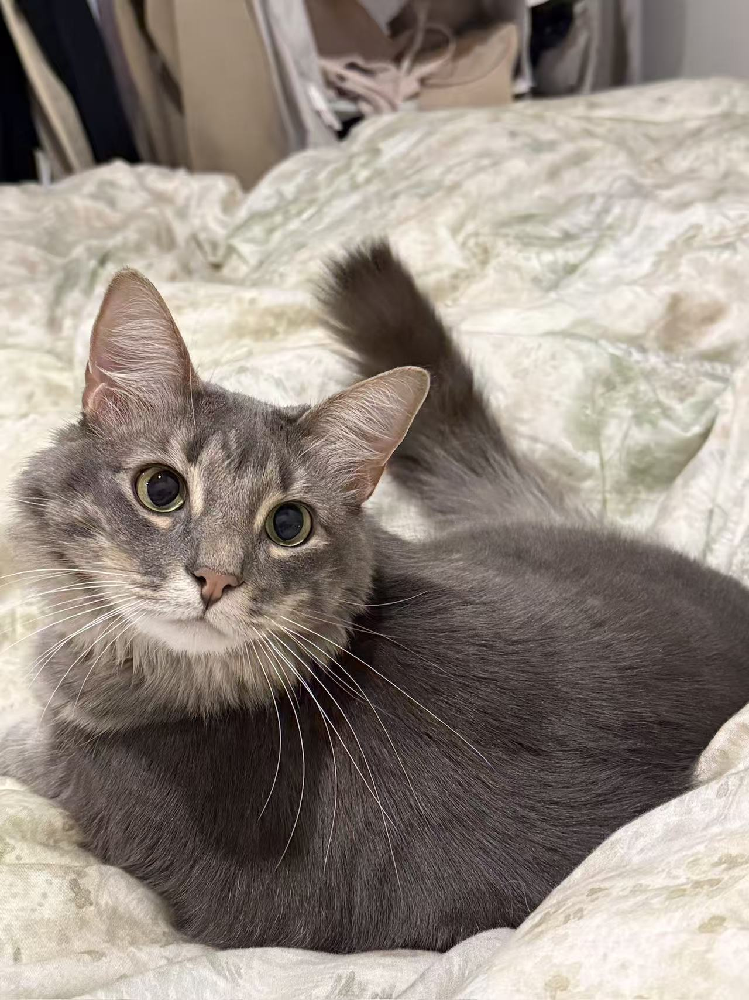

  <!-- 左栏：头像 + 联系方式 -->
  

    

    

      CS Graduate Student 
      Duke University
    

    

      📧 <a href="mailto:felixchen713@gmail.com">felixchen713@gmail.com</a> 
      🔗 <a href="https://www.linkedin.com/in/xiaoxing-chen-8448b7263/">LinkedIn</a> 
      🐙 <a href="https://github.com/felixchen0713">GitHub</a>
    

  

  <!-- 右栏：正文内容 -->
  

    ## Hi, I'm Xiaoxing Chen

    I am a **CS graduate student at Duke University**, focusing on **systems and security**.
    My academic interests include system design, security, and building reliable software systems.

    ### A little about me

    Outside of research and coding, I’m a big cat person 🐱 and a sports enthusiast 🏸🏀.  
    I enjoy playing badminton and basketball whenever I’m not in front of a screen.

    This is my cat — usually saying hi, sometimes judging my code:

    

    

      My cat saying hi 🐾
    

  

